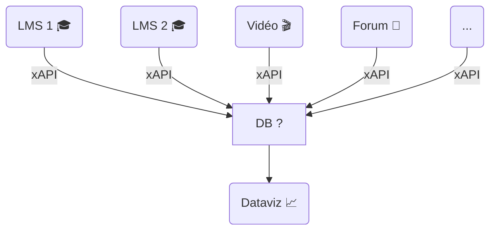
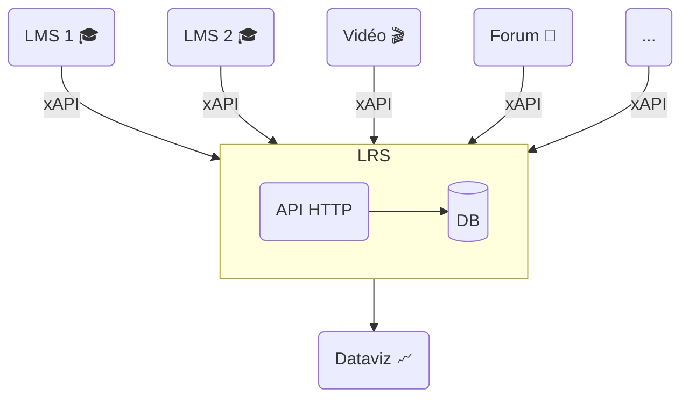
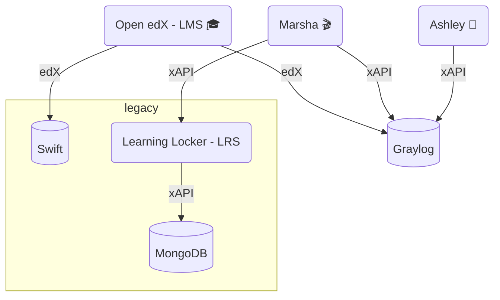
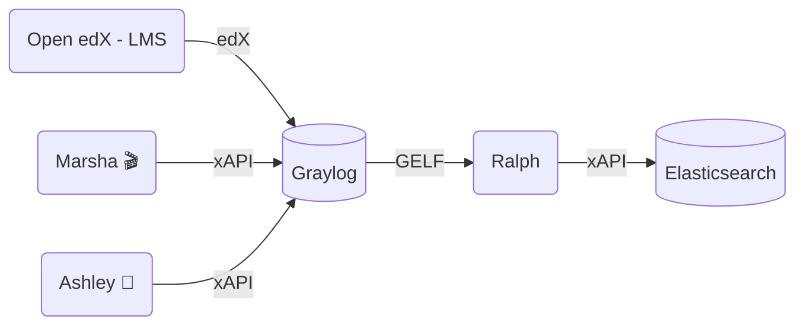
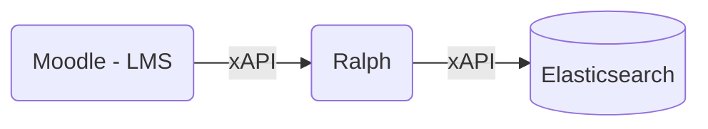

# xAPI au service des Learning Analytics

<div class="abs-br m-6 flex gap-2">
  <a href="https://github.com/openfun/2024-dne-xapi-la-stack" target="_blank" alt="GitHub" title="Open in GitHub"
    class="text-xl slidev-icon-btn opacity-50 !border-none !hover:text-white">
    <carbon-logo-github />
  </a>
</div>

---
transition: fade-out
---

# FUN

<!-- Slides de présentation par Ollivier -->

---
transition: fade-out
---

# Qu'est-ce qu'xAPI ?

e**X**perience **API**

- Spécification des données d'usage et d'activité dans l'apprentissage en ligne
- Format universel de données
- Standard open-source: libre d'accès et utilisation gratuite
- Interopérabilité

## Chronologie

- 2011: Initiative d'ADL (Advanced Distributed Learning) pour remplacer SCORM, devenu
  trop limitant en terme d'interopérabilité
  par un groupe de travail international
- 2013: Publication de la première version d'xAPI
- 2023: Publication de xAPI V2 - spécification IEEE (P9274.2.1)

---
transition: fade-out
---

# Les concepts xAPI

- Format de données associant un statement au format JSON à une expérience d'apprentissage
- Triplet d'information requis: {acteur, verbe, objet}
- Information complémentaire: {context, résultat, temps}

---
image: ./images/xapi-statement-model-final.png

transition: fade-out
---

# Exemple

Situation: Alice est inscrite au cours "Apprendre l'anglais en 1 mois" sur
https://fun-mooc.fr. Elle regarde une vidéo et décide de mettre sur pause à 45s pour
pouvoir prendre en note une partie du contenu affiché. Cette action est faite le
10 janvier 2024, à 20h 51m 37s à Saint Brieuc.

_Quelle est la modélisation xAPI de l'action d'Alice 

- Acteur: Alice
- Verbe: Mettre sur pause
- Objet: Vidéo
- Context: cours "apprendre l'anglais en 1 mois"
- Résultat: "mise en pause à 45 secondes de la vidéo"
- Temps: 20h51min37s UTC+2

<!-- Snippets du statement xAPI correspondant -->

---
transition: fade-out
---

# Acteur

Alice

```json
{
  "actor": {
    "objectType": "Agent",
    "account": {
      "name": "alice_dupont",
      "homePage": "https://fun-mooc.fr"
    }
  }
}
```

---
transition: fade-out
---

# Verbe

Mettre sur pause

```json
{
  "verb": {
    "id": "https://w3id.org/xapi/video/verbs/paused",
      "display":{
        "fr": "mis sur pause"
      }
  }
}
```

---
transition: fade-out
---

# Objet

Vidéo de la leçon 2 sur les auxiliaires "have" et "be"

```json
{
  "object": {
    "objectType": "Activity",
    "id": "uuid://23fa7583-5874-4a6d-9d3d-2faaaff45438",
    "definition": {
      "type": "https://w3id.org/xapi/video/activity-type/video",
      "name": {
        "fr": "S1_L2_auxiliaire_be_have.mp4"
      }
    }
  }
}
```

---
transition: fade-out
---

# Contexte

- Cours "Apprendre l'anglais en 1 mois"
- Longueur de la vidéo
- Taux de complétion de la vidéo

```json
{
  "context": {
    "contextActivites":{
      "parent": {
        "objectType": "Activity",
        "id": "https://lms.fun-mooc.fr/courses/course-v1:UnivAnglais+00001+session27/courseware/swkytth28bk3jnp2zocjy81p27t52fsx/",
        "definition": {
          "type": "http://adlnet.gov/expapi/activities/course",
          "name": {
            "fr": "Apprendre l'anglais en 1 mois"
          }
        }
      },
    },
    "extensions": {
      "https://w3id.org/xapi/video/extensions/length": 180.67,
      "https://w3id.org/xapi/video/extensions/completion-threshold": 0.25
    }
  }
}
```

---
transition: fade-out
---

# Résultat

Temps de l'action sur la durée de la vidéo
- Cumul des segments de la vidéo déjà visionnés
- Complétion de la vidéo

```json
{
  "result": {
    "extensions": {
      "https://w3id.org/xapi/video/extensions/time": 45.23,
      "https://w3id.org/xapi/video/extensions/played-segments": "0[.]45.23", 
      "https://w3id.org/xapi/video/extensions/progress": 0.25
    }
  }
}
```

---
transition: fade-out
---

# Identification du _statement_

```json
{
  "timestamp": "2024-01-10T18:51:37.666723+00:00",
  "id": "d928a86f-cd94-4dbd-uba0-f55dc2017b61", 
}
```
---
transition: fade-out
---

# Les profils xAPI

- Spécification des expériences d'apprentissage pour un type de ressource
  pédagogique
- Ontologie pour l'écriture des _statements_
- Profils officiels du standard disponible sur le [serveur de profils xAPI](https://profiles.adlnet.gov/)

---
transition: fade-out
---

# Exemple de profil 

Classe virtuelle

- Co-développement par Sébastien Fraysse et France Université Numérique
- Approche multi-niveaux: macro, méso, micro
- Publication sur le serveur
- Rédaction et maintenance d'une documentation utilisateur

---
transition: fade-out
---

# Comment utiliser les profils xAPI ? 

1. Utiliser les profils publics s'ils répondent aux besoins
2. Spécifier et publier un profil sur le serveur sinon, en veillant à l'universalité du
   profil
3. Maintenir un profil privé si le cas d'usage est spécifique, interne ou
   confidentiel
4. Versionner le profil à chaque modification de la spécification
5. Tenir une documentation utilisateur à jour (en complément du profil publié
   pour un profil officiel ou privée pour un profil non publiée)

---
layout: section
transition: fade-out
---

# Le *Learning Record Store* (LRS)


---
transition: fade-out
---

# Comment stocker les traces d'apprentissages ?

Dans une base de données ?

Besoins de : 
- **Centraliser** ces traces à un même endroit
- Pouvoir les **rendre disponible** à d'autres services (outil de *data visualization*)

<br>

<div align="center">

</div>
---
transition: fade-out
---

# Le standard LRS

ADL avec la spécification xAPI, définit le Learning Record Store (LRS)

<div align="center">


</div>

---
transition: fade-out
---

# Le standard LRS (2)

Le LRS est "un serveur (i.e. un système capable de recevoir et de traiter des requêtes web) qui est responsable de la réception, du stockage et de l'accès aux Learning Records." 

<div class="grid grid-cols-2 gap-4">
<div>

Ce standard  définit :
- l'authentification et les permissions
- la validation des requêtes
- la validation des données entrantes
- la détection de conflits
- la manière de filtrer et rechercher des *Learning Records*
- le format de restitution

Le LRS est généralement *headless*

</div>

<div>

<br>
<br>


</div>
</div>

---
transition: fade-out
---

# Plusieurs APIs

Un LRS définit plusieurs API (ou endpoints)

L'endpoint principal :

- `statements` pour les traces d'apprentissages au format xAPI

D'autres endpoints permettent de stocker des documents, afin d'enrichir ces traces :
- `agents` et `agents/profile` : informations identifiantes d'un agent
- `activities`, `activities/profile` et `activities/state` : description d'une activité, de l'état d'un agent sur une activité
- `about` : informations sur le LRS
- `extensions/"votreextension"` : pour d'autres ressources non définies par la spécification 

---
transition: fade-out
---

# Total Learning Architecture (TLA)

L'apprentissage est un processus permanent : il doit se faire partout, sous toutes ses formes et tout au long de la vie

<div class="grid grid-cols-2 gap-4">
<div>

### La TLA, c'est :
- les traces d'apprentissages (**xAPI et LRS**)
- un index des activités pédagogiques (**XI**)
- un référentiel de compétences
- un profil apprenant

<br>

### 3 types de LRS :
1. *Noisy LRS*
2. *Transactional LRS*
3. *Authoritative LRS*

</div>
<div>

### 5 niveaux de maturité :
1. adoption locale d'xAPI
2. xAPI à plus grande échelle
3. activités pédagogiques <-> compétences 
4. apprenants <-> compétences (LRS transactionnel et LRS d'autorité)
5. valorisation des données apprenants

</div>
</div>

---
layout: section
transition: fade-out
---

# Ralph, le LRS de FUN

---
transition: fade-out
---

# Ralph : le contexte  

<div align="center">



</div>

---
transition: fade-out
---

# Le plan

- Mise en place d'un *data lake* basé sur Elasticsearch, dédié *learning analytics*
- Développer un outil Python capable de récupérer et de transformer des données à partir de différents backends
- Développer un outil qui tient la charge importante chez FUN (bonne scalabilité)

---
transition: fade-out
---

# Avancement actuel

<br>

<div align="center">





</div>

---
transition: fade-out
---

# Ralph LRS

Les caractéristiques de Ralph :

- Entièrement open source
- Basé sur [FastAPI](https://fastapi.tiangolo.com/)
- Backends compatibles  : Elasticsearch, MongoDB, ClickHouse
- Support du *forwarding* des traces
- Bonne scalabilité
- Support de HTTP Basic Auth et OpenIDConnect
- Choix de ne pas développer tous les aspects de la spécification LRS
- *headless*, sans interface graphique, et sans *data visualization*

---
transition: fade-out
---

#  Ralph CLI


- Validation ou conversion des traces dans différents standards
- Lecture/Ecriture des traces dans différentes bases de données/serveurs
- Aide à la configuration du LRS

<br>

<div class="grid grid-cols-2 gap-4">
<div>

```
Usage: ralph [OPTIONS] COMMAND [ARGS]...

  The cli is a stream-based tool to play with your logs.

Commands:
  auth       Generate credentials for LRS HTTP basic authentication.
  convert    Convert input events to a given format.
  extract    Extract input events from a container format using a...
  list       List available documents from a configured data backend.
  read       Read records matching the QUERY (json or string) from a...
  runserver  Run the API server for the development environment.
  validate   Validate input events of given format.
  write      Write an archive to a configured backend.
```

</div>

<div>


Exemple : afficher le top 100 des agents qui ont générés le plus d'évènements 

```
ralph read --backend swift 20231023.xapi.gz | \
    jq .actor.account.name | \
    sort | \
    uniq -c | \
    sort -rn | \
    head -n 100
```

</div>
</div>

---
transition: fade-out
---

# Ralph - Librairie

Un outil CLI c'est pratique, mais écrire du code Python c'est mieux !

Dans quel but ?
- Facilite l'intégration/l'adoption des développeurs
- Maintenabilité
- Utilisable dans des notebooks Jupyter

<br>

#### Modèles xAPI et edX

- intégrable dans les *Learning Record Providers*, facilite la génération de traces
- utilisation des convertisseurs de modèles (edX en xAPI)

<br>

#### Backend LRS

- intégrable dans les *Learning Record Consumer*, comme les outils de *data visualization* : Warren 📈
---
transition: fade-out
---

## Ralph v4

Released en 01/2024 🎉

- Ajout support du multitenant
- Unification des backends
- Refonte de la documentation
- Ajout de nouveaux profils xAPI
- Ajout de nouveaux convertisseurs format edX en format xAPI
- Ajout d'un backend "LRS", pour requêter facilement un LRS depuis Python (utilisé dans Warren 📈)

## Ralph v5 - pour 2024.3

- Architecture plugin : flexibilité pour l'ajout de nouveau backend
- Utilisation de Pydantic v2 pour les modèles

---
layout: full
transition: fade-out
---

# Merci de votre attention !

<br>

<div class="grid grid-cols-3 gap-4 credits">
  <div>
    🎓
    <a href="https://openfun.github.io/2024-dne-xapi-la-stack/">
      Slides
    </a>
    <br/>
    
  </div>
  <div>
    <logos-github-icon />
    <a href="https://github.com/openfun/ralph">
      openfun/ralph
    </a>
    
  </div>
  <div>
    <logos-discord-icon />
    <a href="https://discord.gg/yzaGJ4r6">
      OpenFUN
    </a>
    
  </div>
</div>

<style>
.credits {
  margin-top: 1rem;
  text-align: center;
}
.logo {
  display: block;
  margin: 1rem auto 0;
}
</style>
