# xAPI au service des Learning Analytics

## Wilfried Baradat, Ollivier Haemmerlé, Quitterie Lucas et Manuel Raynaud

France Université Numérique, 2 avril 2024, Lab 110 Paris

<div class="abs-br m-6 flex gap-2">
  <a href="https://github.com/openfun/2024-dne-xapi-la-stack" target="_blank" alt="GitHub" title="Open in GitHub"
    class="text-xl slidev-icon-btn opacity-50 !border-none !hover:text-white">
    <carbon-logo-github />
  </a>
</div>

---
layout: section
transition: fade-out
---

# France Université Numérique

---
transition: fade-out
---

# Les missions de FUN

<br>

<div class="grid grid-cols-2 gap-4">
<div>

- **Anime et coordonne l’offre de cours** des établissements éditeurs et développe des actions de formation et d’animation des équipes productrices de cours 
- **Fournit des services éditoriaux et de certification** des cours en ligne  
- **Met à disposition une infrastructure d’hébergement** sécurisée, des services,
  des applications et des ressources numériques

</div>
<div>

- **Assure la promotion** de l’écosystème, des plateformes de diffusion et des cours et formations en ligne, et le développement de la marque FUN
- **Participe au développement des actions de formation professionnelle** des établissements ​
- **Contribue à l’expérimentation et l’étude des pratiques pédagogiques**, et au développement des technologies au service de l’apprentissage ​

</div>
</div>

---
layout: image
image: ./fun-chiffre-24.png
backgroundSize: 65%
transition: fade-out
---

# Les chiffres de janvier 2024

---
layout: image
image: ./annee-23.png
backgroundSize: 80%
transition: fade-out
---

# L'année 2023

---
layout: image
image: ./fun-departement.png
backgroundSize: 60%
transition: fade-out
---

# Les départements

---
transition: fade-out
---

# Département technique

<div class="grid grid-cols-2 gap-4">
<div>

**Objectifs**

- Développement des outils et de l'infrastructure de l'univers FUN
- Développements de briques autonomes focalisées sur des périmètres (forum, vidéo, streaming, catalogue, etc.) => agnostique d'un LMS
- Gestion de l'infrastructure : performance et résilience
- 100 % des projets open source

</div>
<div>

**Projets**

- Richie (catalogue)
- Joanie (ecommerce)
- Ashley (forum)
- Marsha (LCMS)
- Cunningham (Design System)
- Verna (Form builder)
- Kubic (k8s as code)

<br>

- Moodle
- Open edX

</div>
</div>

---
transition: fade-out
---

# Département data

<div class="grid grid-cols-2 gap-4">
<div>

**Objectifs**

- Organiser la collecte, la transformation et le stockage des **traces d'apprentissage** générées par les apprenants sur tous nos **services** / toutes nos **plateformes**
- Valoriser les traces :
    - Dashboards équipes pédagogiques
    - Dashboards apprenant
- Assister les travaux de recherche liés aux traces

</div>
<div>

**Services**

- OpenEdx
- Moodle
- Marsha (vidéos, documents)
- Ashley (forum)

</div>
</div>

---
layout: section
transition: fade-out
---

# Qu'est-ce qu'xAPI ?

e**X**perience **API**

---
transition: fade-out
---

## Caractéristiques

🏫 **Standard**. Spécification des données d'usage et d'activité dans l'apprentissage en ligne <br />
📖 **Open-source**. Libre d'accès et utilisation gratuite <br />
🌍 **Universalité**. Format universel de données <br />
🕸️ **Interopérabilité**. Contrer le traitement des silos de données <br />

## Chronologie

**2011**. Initiative d'ADL (Advanced Distributed Learning) pour remplacer SCORM, devenu
  trop limitant en terme d'interopérabilité par un groupe de travail
  international.  <br />
**2013**. Publication de la première version d'xAPI  <br />
**2023**. Publication de xAPI V2 - spécification IEEE (P9274.2.1)  <br />

---
transition: fade-out
---

## Concepts

🧑‍🎓 Format de données décrivant une expérience d'apprentissage avec un statement
  écrit en JSON <br />
🖥️ Formalisation grammaticale d'une action d'apprentissage de type "Sujet,
Verbe, Complément" <br />

```json
{
  "acteur": "La personne concernée par le statement",
  "verbe": "L'action faite par l'acteur",
  "objet": "L'objet sur lequel l'acteur a agi",
  "résultat": "Détails complémentaires sur le résultat de l'action",
  "contexte": "Information contextuelle complémentaire", 
  "temps": "Quand l'objet a été soumis à l'action"
}
```

---
transition: fade-out
---

# Exemple

Alice est inscrite au cours "Apprendre l'anglais en 1 mois" sur
https://fun-mooc.fr.
Elle regarde la vidéo de la leçon 2 sur les auxiliaires "have" et "be".
Elle décide de mettre sur pause à 45s pour pouvoir prendre en note une partie du
contenu affiché.
Cette action est faite le 10 janvier 2024, à 20h 51m 37s à Saint-Brieuc.

_Quelle est la modélisation xAPI de l'action d'Alice ?_

1. Acteur: Alice
2. Verbe: Mettre sur pause
3. Objet: Vidéo sur les auxiliaires "have" et "be"
4. Contexte: Cours "Apprendre l'anglais en 1 mois"
5. Résultat: Mise en pause à 45 secondes de la vidéo
6. Temps: 20h51min37s UTC+2

---
transition: fade-out
---

## Acteur

👱🏼‍♀️ Alice <br />

```json
{
  "actor": {
    "objectType": "Agent",
    "account": {
      "name": "alice_dupont",
      "homePage": "https://fun-mooc.fr"
    }
  }
}
```

---
transition: fade-out
---

## Verbe

⏸️ Mettre sur pause <br />

```json
{
  "verb": {
    "id": "https://w3id.org/xapi/video/verbs/paused",
      "display": {
        "fr": "mis sur pause"
      }
  }
}
```

---
transition: fade-out
---

## Objet

📼 Vidéo de la leçon 2 sur les auxiliaires "have" et "be"

```json
{
  "object": {
    "objectType": "Activity",
    "id": "uuid://23fa7583-5874-4a6d-9d3d-2faaaff45438",
    "definition": {
      "type": "https://w3id.org/xapi/video/activity-type/video",
      "name": {
        "fr": "S1_L2_auxiliaire_be_have.mp4"
      }
    }
  }
}
```

---
transition: fade-out
---

## Contexte

📗 Cours "Apprendre l'anglais en 1 mois" <br />
📏 Longueur de la vidéo <br />
🔣 Taux de complétion de la vidéo <br />

```json
{
  "context": {
    "contextActivites":{
      "parent": {
        "objectType": "Activity",
        "id": "https://lms.fun-mooc.fr/courses/course-v1:UnivAnglais+00001+session27/courseware/swkytth28bk3jnp2zocjy81p27t52fsx/",
        "definition": {
          "type": "http://adlnet.gov/expapi/activities/course",
          "name": {
            "fr": "Apprendre l'anglais en 1 mois"
          }
        }
      },
    },
    "extensions": {
      "https://w3id.org/xapi/video/extensions/length": 180.67,
      "https://w3id.org/xapi/video/extensions/completion-threshold": 0.25
    }
  }
}
```

---
transition: fade-out
---

## Résultat

⏲️ Temps de l'action sur la durée de la vidéo <br />
🎞️ Cumul des segments de la vidéo déjà visionnés <br />
⏳ Pourcentage de la vidéo vu par Alice <br />

```json
{
  "result": {
    "extensions": {
      "https://w3id.org/xapi/video/extensions/time": 45.23,
      "https://w3id.org/xapi/video/extensions/played-segments": "0[.]45.23",
      "https://w3id.org/xapi/video/extensions/progress": 0.25
    }
  }
}
```

---
transition: fade-out
---

## Temps

⏱️ 10 janvier 2024, 20h 51min 37s UTC+2 <br />

```json
{
  "timestamp": "2024-01-10T18:51:37.666723+00:00"
}
```

---
layout: section
transition: fade-out
---

# Les profils xAPI

---
transition: fade-out
---

## Qu'est-ce qu'un profil xAPI ? 

<br>

<div class="grid grid-cols-2 gap-4">

<div>

**Ontologie** pour les _learning analytics_ regroupant un ensemble de spécification
pour décrire les interactions avec une ressource d'apprentissage.

- Modèles de _statements_ décrivant une expérience d'apprentissage
- Propriétés et règles associées défini pour les modèles de _statements_
- Vocabulaire utilisé dans les modèles de _statements_ <br />

[Aperçu du profil associé à la ressource vidéo](https://profiles.adlnet.gov/profile/fc6b904c-e8d0-4a84-987f-a0f5313cec6f)

</div>

<div>
Bibliothèque des profils officiels du standard disponibles sur le 
serveur ADLNET 👇
<br>
<br>

</div>

</div>
---
transition: fade-out
---

## Comment concevoir un profil xAPI ? 

Exemple du profil "classe virtuelle"

- Co-développement par Sébastien Fraysse et France Université Numérique
- Rédaction et maintenance d'une documentation utilisateur
- Travail de conception avec une approche à 3 niveaux pour définir les modèles
  de _statements_

_On associe à une expérience d'apprentissage un modèle de_ statements _mais comment savoir quelles expériences représenter dans le profil ?_

| **MACROSCOPIQUE** | _Quelles sont les activités essentielles à tracer?_ |
|---|---|
| **MESOSCOPIQUE** | _Quelles sont les activités qui apportent des informations de suivi pédagogiques à la classe virtuelle?_ |
| **MICROSCOPIQUE** | _Quelles sont les activités qui apportent un complément d'informations, utiles pour l'enrichissement du suivi pédagogique?_ |

---
transition: fade-out
---

## Comment utiliser les profils xAPI ?

_Les bonnes pratiques_

1. Utiliser les profils publics s'ils répondent aux besoins
2. Spécifier et publier un profil sur le serveur sinon, en veillant à l'universalité du
   profil
3. Maintenir un profil privé si le cas d'usage est spécifique, interne ou
   confidentiel
4. Versionner le profil à chaque modification de la spécification
5. Tenir une documentation utilisateur à jour (en complément du profil publié
   pour un profil officiel ou privée pour un profil non publiée)

---
layout: section
transition: fade-out
---

# Le *Learning Record Store* (LRS)

---
transition: fade-out
---

# Comment stocker les traces d'apprentissages ?

Dans une base de données ?

Besoins de : 
- **Centraliser** ces traces à un même endroit
- Pouvoir les **rendre disponible** à d'autres services (outil de *data visualization*)

```mermaid {scale: 1}
flowchart TD
    lms("LMS 1 🎓") -- xAPI --> db["DB ?"]
    lms2("LMS 2 🎓") -- xAPI --> db
    marsha("Vidéo 🎬") -- xAPI --> db
    ashley("Forum 💬") -- xAPI --> db
    other("...") -- xAPI -->  db
    db --> dataviz("Dataviz 📈") 
```

<br>

<div align="center">

</div>
---
transition: fade-out
---

# Le standard LRS

ADL avec la spécification xAPI, définit le Learning Record Store (LRS)

```mermaid {scale: 1}
flowchart TD
    subgraph LRS
        lrs("API HTTP") --> db[(DB)]
    end

    lms("LMS 1 🎓") -- xAPI --> LRS
    lms2("LMS 2 🎓") -- xAPI --> LRS
    marsha("Vidéo 🎬") -- xAPI --> LRS
    ashley("Forum 💬") -- xAPI --> LRS
    other("...") -- xAPI -->  LRS
    LRS --> dataviz("Dataviz 📈") 
```

<div align="center">


</div>

---
transition: fade-out
---

# Le standard LRS (2)

Le LRS est "un serveur (i.e. un système capable de recevoir et de traiter des requêtes web) qui est responsable de la réception, du stockage et de l'accès aux Learning Records." 

Ce standard  définit :
- l'authentification et les permissions
- la validation des requêtes
- la validation des données entrantes
- la détection de conflits
- la manière de filtrer et rechercher des *Learning Records*
- le format de restitution

Le LRS est généralement *headless*

---
transition: fade-out
---

# Plusieurs APIs

Un LRS définit plusieurs API (ou endpoints)

L'endpoint principal :

- `statements` pour les traces d'apprentissages au format xAPI

D'autres endpoints permettent de stocker des documents, afin d'enrichir ces traces :
- `agents` et `agents/profile` : informations identifiantes d'un agent
- `activities`, `activities/profile` et `activities/state` : description d'une activité, de l'état d'un agent sur une activité
- `about` : informations sur le LRS
- `extensions/"votreextension"` : pour d'autres ressources non définies par la spécification 

---
transition: fade-out
---

# Total Learning Architecture (TLA)

L'apprentissage est un processus permanent : il doit se faire partout, sous toutes ses formes et tout au long de la vie

<div class="grid grid-cols-2 gap-4">
<div>

### La TLA, c'est :
- les traces d'apprentissages (**xAPI et LRS**)
- un index des activités pédagogiques (**XI**)
- un référentiel de compétences
- un profil apprenant

<br>

### 3 types de LRS :
1. *Noisy LRS*
2. *Transactional LRS*
3. *Authoritative LRS*

</div>
<div>

### 5 niveaux de maturité :
1. adoption locale d'xAPI
2. xAPI à plus grande échelle
3. activités pédagogiques <-> compétences 
4. apprenants <-> compétences (LRS transactionnel et LRS d'autorité)
5. valorisation des données apprenants

</div>
</div>

---
layout: section
transition: fade-out
---

# Ralph, le LRS de FUN

---
transition: fade-out
---

# Ralph : le contexte  

```mermaid {scale: 1}
flowchart TB
    openedx(Open edX - LMS 🎓) -- edX --> graylog
    openedx -- edX --> swift
    subgraph legacy
    swift[(Swift)]
    ll(Learning Locker - LRS) -- xAPI --> mongo[(MongoDB)]
    end
    marsha(Marsha 🎬) -- xAPI --> graylog[(Graylog)]
    marsha -- xAPI --> ll
    ashley(Ashley 💬) -- xAPI --> graylog
```

<div align="center">



</div>

---
transition: fade-out
---

# Le plan

- Mise en place d'un *data lake* basé sur Elasticsearch, dédié *learning analytics*
- Développer un outil Python capable de récupérer et de transformer des données à partir de différents backends
- Développer un outil qui tient la charge importante chez FUN (bonne scalabilité)

---
transition: fade-out
---

# Avancement actuel

```mermaid
flowchart LR
    openedx(Open edX - LMS) -- edX --> graylog
    marsha(Marsha 🎬) -- xAPI --> graylog
    ashley(Ashley 💬) -- xAPI --> graylog
    graylog[(Graylog)] -- GELF --> ralph(Ralph) -- xAPI --> es[(Elasticsearch)]
```

<br>

<div align="center">




</div>

---
transition: fade-out
---

# Ralph LRS

Les caractéristiques de Ralph :

- Entièrement open source
- Basé sur [FastAPI](https://fastapi.tiangolo.com/)
- Backends compatibles  : Elasticsearch, MongoDB, ClickHouse
- Support du *forwarding* des traces
- Bonne scalabilité
- Support de HTTP Basic Auth et OpenIDConnect
- Choix de ne pas développer tous les aspects de la spécification LRS
- *headless*, sans interface graphique, et sans *data visualization*

---
transition: fade-out
---

#  Ralph CLI


- Validation ou conversion des traces dans différents standards
- Lecture/Ecriture des traces dans différentes bases de données/serveurs
- Aide à la configuration du LRS

<br>

<div class="grid grid-cols-2 gap-4">
<div>

```
Usage: ralph [OPTIONS] COMMAND [ARGS]...

  The cli is a stream-based tool to play with your logs.

Commands:
  auth       Generate credentials for LRS HTTP basic authentication.
  convert    Convert input events to a given format.
  extract    Extract input events from a container format using a...
  list       List available documents from a configured data backend.
  read       Read records matching the QUERY (json or string) from a...
  runserver  Run the API server for the development environment.
  validate   Validate input events of given format.
  write      Write an archive to a configured backend.
```

</div>

<div>


Exemple : afficher le top 100 des agents qui ont générés le plus d'évènements 

```
ralph read --backend swift 20231023.xapi.gz | \
    jq .actor.account.name | \
    sort | \
    uniq -c | \
    sort -rn | \
    head -n 100
```

</div>
</div>

---
transition: fade-out
---

# Ralph - Librairie

Un outil CLI c'est pratique, mais écrire du code Python c'est mieux !

Dans quel but ?
- Facilite l'intégration/l'adoption des développeurs
- Maintenabilité
- Utilisable dans des notebooks Jupyter

<br>

#### Modèles xAPI et edX

- intégrable dans les *Learning Record Providers*, facilite la génération de traces
- utilisation des convertisseurs de modèles (edX en xAPI)

<br>

#### Backend LRS

- intégrable dans les *Learning Record Consumer*, comme les outils de *data visualization* : Warren 📈
---
transition: fade-out
---

## Ralph v4

Released en 01/2024 🎉

- Ajout support du multitenant
- Unification des backends
- Refonte de la documentation
- Ajout de nouveaux profils xAPI
- Ajout de nouveaux convertisseurs format edX en format xAPI
- Ajout d'un backend "LRS", pour requêter facilement un LRS depuis Python (utilisé dans Warren 📈)

## Ralph v5 - pour 2024.3

- Architecture plugin : flexibilité pour l'ajout de nouveau backend
- Utilisation de Pydantic v2 pour les modèles

---
layout: end
transition: fade-out
---

# Merci de votre attention !

<br>

<div class="grid grid-cols-3 gap-4 credits">
  <div>
    🎓
    <a href="https://openfun.github.io/2024-dne-xapi-la-stack/">
      Slides
    </a>
    <br/>
    
  </div>
  <div>
    <logos-github-icon />
    <a href="https://github.com/openfun/ralph">
      openfun/ralph
    </a>
    
  </div>
  <div>
    <logos-discord-icon />
    <a href="https://discord.gg/yzaGJ4r6">
      OpenFUN
    </a>
    
  </div>
</div>

<style>
.credits {
  margin-top: 1rem;
  text-align: center;
}
.logo {
  display: block;
  margin: 1rem auto 0;
}
</style>
